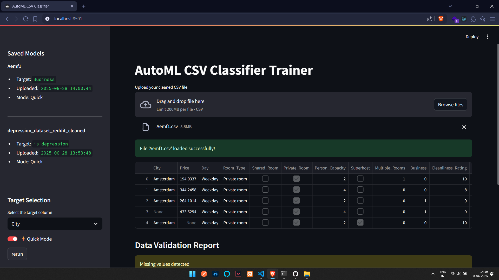

# 🤖 AutoML CSV Classifier

A simple Streamlit web application that allows users to upload a cleaned CSV file, select a target column, and automatically train classification models using PyCaret. Trained models and their metadata are stored and listed using MongoDB.

---

## 🚀 Features

- Upload and preview CSV datasets
- Automatic column cleaning and null check
- Choose target column for classification
- Train models using PyCaret AutoML
- Quick Mode (faster) and Full Mode options
- Save trained model and metadata to MongoDB
- View and download previously trained models from sidebar

---

## 🛠️ Tech Stack

- **Frontend:** [Streamlit](https://streamlit.io/)
- **Backend (ML):** [PyCaret](https://pycaret.org/)
- **Database:** [MongoDB](https://www.mongodb.com/)
- **Language:** Python 3

---

## Install Deps and run

- pip install -r requirements.txt
- streamlit run app.py

## Image
- 